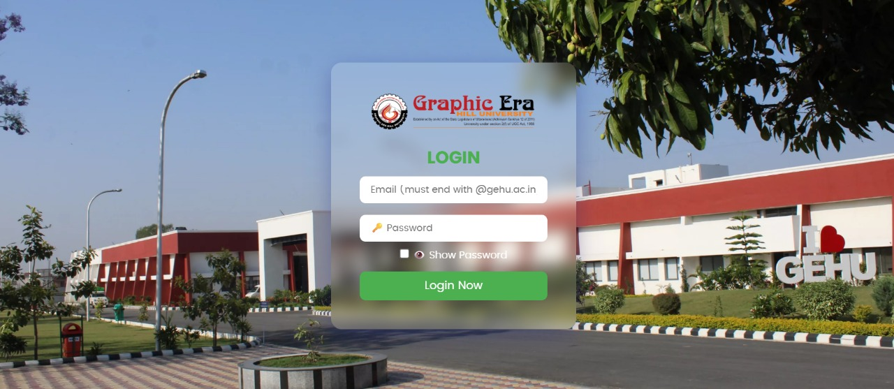
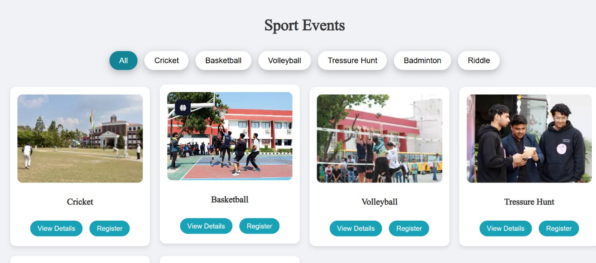
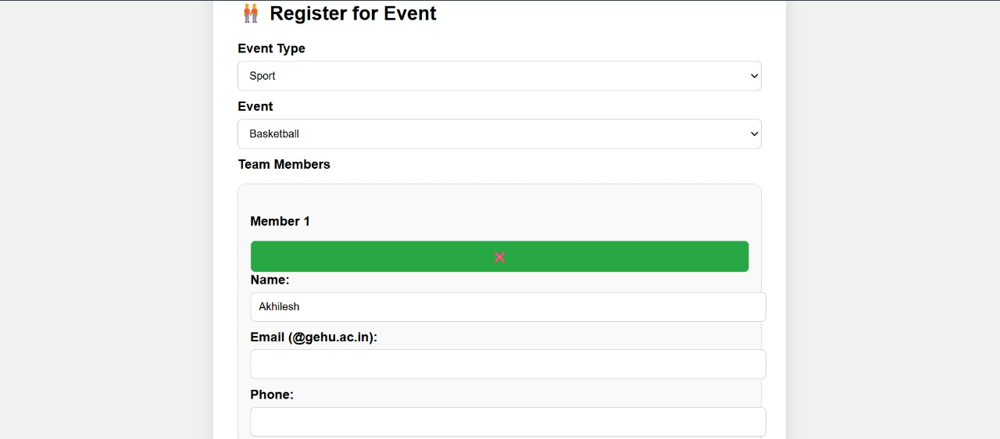
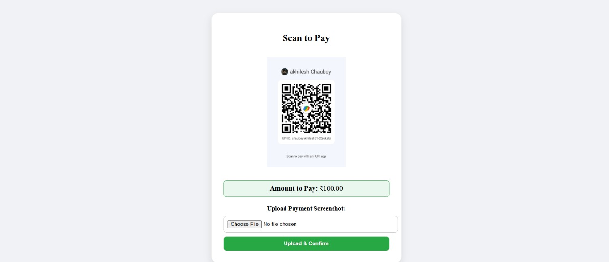
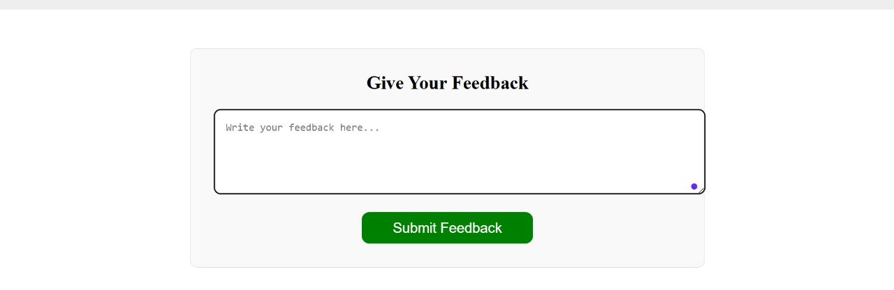
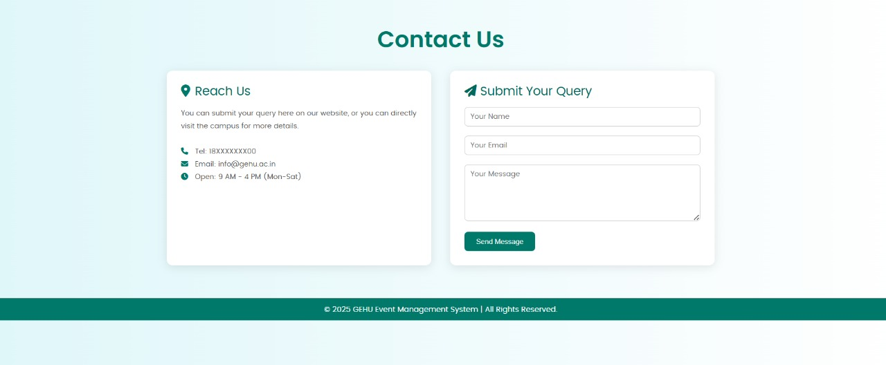

# 🎓 College Event Management System (CEMS)

A full-featured web-based portal to manage college events with user registration, event booking, admin management, and QR-based payment system.

🔗 **GitHub Repo**: [Click Here](https://github.com/akhileshchaubey51/akhileshchaubey51-College-Event-management-System)

---

## 🚀 Project Overview

The College Event Management System (CEMS) simplifies college-level event management by providing a centralized platform for student registration, event filtering, payment handling, and admin control.

📁 **Tech Stack**: PHP, MySQL, HTML, CSS, JavaScript, Bootstrap

---

## ✅ Features

### 👨‍🎓 For Students:
- Register and Login
- Browse & Filter Events by Category
- Register for Single or Multi-member Events
- QR Code Payment with Screenshot Upload
- Feedback and Contact Form

### 🛠️ For Admin:
- Secure Login
- Manage Events, Categories, Users, Payments
- View Registrations and Uploaded Screenshots
- Website Settings, Gallery, and News Handling

---

## 🖼️ Screenshots

### 🔐 Login Page  

### 🏀 Sport Events with Filters  

### 📝 Register for Event (Multi-Member)  

### 💳 QR Code Payment  

### 💬 Feedback Page  

### 📞 Contact Page  

> 🗂️ *Save all images in a folder named `screenshots/` in your repo before pushing.*

---

## 🛠️ Technologies Used

| Frontend         | Backend       | Database  | Others          |
|------------------|---------------|-----------|-----------------|
| HTML, CSS, JS     | PHP           | MySQL     | Bootstrap 5     |
|                  |               |           | XAMPP (Localhost)|

---

## 🔧 How to Run the Project

1. Install **XAMPP**
2. Place project in `C:/xampp/htdocs/CEMS`
3. Import the provided `.sql` file into phpMyAdmin
4. Start Apache & MySQL
5. Visit `http://localhost/CEMS`

---

## 🙋‍♂️ Author

**Akhilesh Chaubey**  
📧 [chaubeyakhilesh51@gmail.com](mailto:chaubeyakhilesh51@gmail.com)  
🌐 [LinkedIn](https://www.linkedin.com/in/akhileshchaubey51)

---

## 📄 License

This project is open-source and free to use for learning & academic purposes.

---
